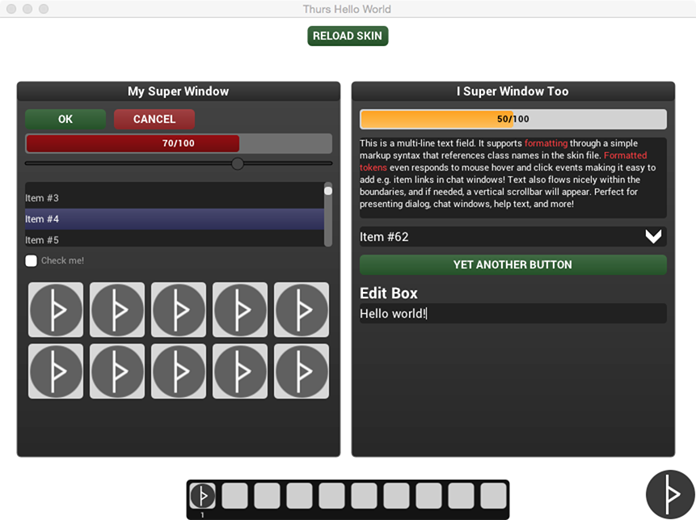

 ThursUI 
=======

**Straight-forward, pretty, and skinnable C++ UI library for games and 3d applications.**

*This is very much a work in progress. Widgets/controls are added on a "I need a xxx right now"-basis as I continue the development of my game and engine. Also note that there are currently no optimizations done on the code what-so-ever - "Make it work, then make it fast." It's also a bit hackish right now, but it works.* 

**Currently supported controls:**
  * Button
  * Progressbar
  * Slider
  * List Box
  * Checkbox
  * Label
  * Dropdown
  * Text input box
  * Rectangle (can be used to display images)
  * Image Grid (useful for e.g. inventories in RPG's)
  * Multi line text fields with formatting
  * Window

**Noteable features:**
  * Drag 'n drop
  * JSON-based CSS-style skinning - no texture maps required (textures are of course supported)
  * Skins are animated - each UI state (such as active and hover) can be skinned separately, and Thurs will animate between them when the state changes
  * Designed around signals/slots (powered by sigslot.h)
  * Light on dependencies
  * Cross-platform
  * Liberally licensed (Simplified BSD for now, might switch to zlib) 

As of now, there's only a renderer back-end for [NanoVG](https://github.com/memononen/nanovg). It should be easy to write a custom renderer - take a look in [`include/thurs/renderers/thurs.renderer.nanovg.hpp`](include/thurs/renderers/thurs.renderer.nanovg.hpp) for a place to start. 

<insert gif here>

## Hello world

## Building

I've only built on OS X so far, but the code should work fine on *NX and Windows. If compiling for windows, you're gonna have to create a VS project file to compile it, or use MinGW. The included makefile probably works on Linux, but I have yet to test it. Will convert to a cross-platform build system eventually.

### Dependencies

Thurs depend on the following libraries:
  * [jsoncpp](https://github.com/open-source-parsers/jsoncpp)

Note that you also need to link with the libraries needed to support the rendering back-end in your application. The default output of the makefile is a thin library, so you need to link with jsoncpp in your final application also.

### Installing
Either copy `include/thurs` and the compiled library from `lib` to your preferred paths, or add `include` and `lib` to your path variable or as search paths in your IDE if you're using one. Running `make install` will move things into `/usr/local/include` and `/usr/local/lib`.

## Documentation (todo)
  
  * Getting started: installing, compiling, and running samples
  * Skinning

## Planned features

## License

Copyright (c) 2014, Chris Vasseng - github.com/cvasseng - cvasseng@gmail.com
All rights reserved.

Redistribution and use in source and binary forms, with or without
modification, are permitted provided that the following conditions are met:

* Redistributions of source code must retain the above copyright notice, this
  list of conditions and the following disclaimer.

* Redistributions in binary form must reproduce the above copyright notice,
  this list of conditions and the following disclaimer in the documentation
  and/or other materials provided with the distribution.

THIS SOFTWARE IS PROVIDED BY THE COPYRIGHT HOLDERS AND CONTRIBUTORS "AS IS"
AND ANY EXPRESS OR IMPLIED WARRANTIES, INCLUDING, BUT NOT LIMITED TO, THE
IMPLIED WARRANTIES OF MERCHANTABILITY AND FITNESS FOR A PARTICULAR PURPOSE ARE
DISCLAIMED. IN NO EVENT SHALL THE COPYRIGHT HOLDER OR CONTRIBUTORS BE LIABLE
FOR ANY DIRECT, INDIRECT, INCIDENTAL, SPECIAL, EXEMPLARY, OR CONSEQUENTIAL
DAMAGES (INCLUDING, BUT NOT LIMITED TO, PROCUREMENT OF SUBSTITUTE GOODS OR
SERVICES; LOSS OF USE, DATA, OR PROFITS; OR BUSINESS INTERRUPTION) HOWEVER
CAUSED AND ON ANY THEORY OF LIABILITY, WHETHER IN CONTRACT, STRICT LIABILITY,
OR TORT (INCLUDING NEGLIGENCE OR OTHERWISE) ARISING IN ANY WAY OUT OF THE USE
OF THIS SOFTWARE, EVEN IF ADVISED OF THE POSSIBILITY OF SUCH DAMAGE.